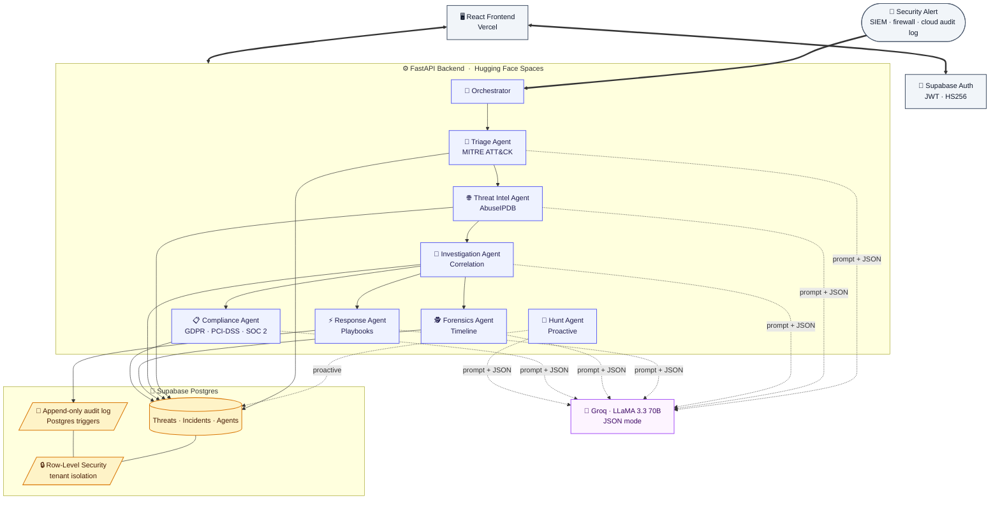

# 🛡️ ThreatBrain

**The Neural SOC - Where AI Agents Converge to Defend**

A production-deployed, multi-tenant AI-driven security operations platform. Seven specialized AI agents work together to triage, enrich, investigate, and respond to security alerts end-to-end - turning hours of analyst work into a 14-second automated pipeline.

> 🌐 **Live demo:** [threat-brain.vercel.app](https://threat-brain.vercel.app)
> 🔑 **Access:** Create your own isolated workspace at `/signup` (no email confirmation), or use the one-click demo bypass on the signup page.
> 💡 **Try the killer feature:** Click **"Trigger pipeline"** on the dashboard and watch the agents work in real time.

---

## 🎯 The Problem

Security analysts in modern SOCs are drowning in alerts. A typical Tier-1 analyst sees thousands of events per shift out of which 95% are false positives, but every single one needs to be checked. The cost is real:

- **Burnout** :- analysts last 18 months on average before quitting
- **Alert fatigue** :- real threats get missed in the noise
- **Slow response** :- by the time an attack is investigated manually, the attacker has moved laterally

## ⚡ The Solution

ThreatBrain turns one alert into a complete investigation in under 15 seconds - without removing humans from the loop. Seven specialized AI agents collaborate on every event:

1. **Triage** :- Classifies severity using MITRE ATT&CK
2. **Threat Intel** :- Enriches IPs against AbuseIPDB
3. **Investigation** :- Correlates with recent threats, groups into incidents
4. **Response** :- Recommends remediation playbooks (human approval required)
5. **Forensics** :- Builds a chain-of-custody timeline
6. **Compliance** :- Assesses GDPR / PCI-DSS / SOC 2 obligations
7. **Hunt** *(proactive)* :- Generates threat-hunting hypotheses

Every decision is logged to an **append-only audit trail** enforced by Postgres triggers, so when this evidence is presented in court or to a regulator, it's verifiable.

---

## 🏗️ Architecture



Each agent is a thin, prompt-engineered service that:

- Accepts **Pydantic-validated input**
- Calls Groq (LLaMA 3.3 70B) in **JSON mode** with a strict output schema
- Persists results with full **input/output/latency/token telemetry**
- Logs every decision to the audit trail

The orchestrator chains six reactive agents on every event. The seventh (Hunt) runs proactively on a schedule.

---

## 🛠️ Tech Stack

| Layer | Technology |
|---|---|
| **Frontend** | React 18 · TypeScript · Vite · Tailwind v4 · shadcn/ui · Framer Motion · Zustand |
| **Backend** | FastAPI · Python 3.11 · Pydantic v2 · LangChain · Tenacity |
| **LLM** | Groq API · LLaMA 3.3 70B · JSON-mode structured outputs |
| **Database** | Supabase (Postgres) · Row-Level Security · Postgres triggers |
| **Auth** | Supabase Auth · JWT (HS256) · multi-tenant via JWT claims |
| **Threat Intel** | AbuseIPDB |
| **Deploy** | Vercel (frontend) · Hugging Face Spaces with Docker (backend) · Supabase (database + auth) |

---

## 🔐 Security Architecture

Security isn't a feature added later, it's the design center.

- **Multi-tenant isolation** :- Every table has an `organization_id`. Postgres RLS policies bind every query to the JWT's `organization_id` claim, so even if backend code has a bug, cross-tenant data can't leak.
- **Prompt injection defense** :- Three layers: Pydantic schema validation on input, LLM JSON mode with strict output schemas, and minimal database permissions per agent. The model has no free-form text channel to misbehave through.
- **Append-only audit logs** :- A Postgres trigger physically rejects `UPDATE` and `DELETE` on `audit_logs`. Even the service role key can't modify history.
- **Human-in-the-loop for action** :- The Response Agent recommends remediation. Real actions require admin role + dry-run flag off + per-playbook authorization. Four independent checks before anything destructive runs.

---

## 🚀 Live Demo

**URL:** https://threat-brain.vercel.app
**Access:** Sign up at `/signup` for your own isolated workspace with seeded data, or take the one-click demo bypass from the signup page.

Things to try:

1. **Browse threats** :- `/threats` shows 12 simulated detections with severity, MITRE codes, confidence scores
2. **Open an incident** :- `/incidents/INC-ACT001` is a simulated APT29 intrusion with kill chain, attribution, 4 linked threats, and lifecycle timestamps
3. **Run the pipeline** :- From the dashboard, click `✨ Trigger pipeline`, pick a scenario (e.g. "S3 bucket made public"), and watch all six agents work in real time. About 15 seconds end-to-end. A brand new threat and incident appear in the database when it finishes.

---

## 📂 Repo Structure

```
ThreatBrain/
├── backend/                  # FastAPI service + AI agents
│   ├── app/
│   │   ├── agents/           # 7 specialized agents (triage, intel, investigation, ...)
│   │   ├── api/v1/endpoints/ # FastAPI routes
│   │   ├── services/         # Orchestrator + Supabase client
│   │   ├── schemas/          # Pydantic models
│   │   └── core/             # Config, security, logging
│   ├── scripts/              # Dev utilities (JWT generators, seed scripts)
│   ├── Dockerfile            # Hugging Face Spaces deploy
│   └── requirements.txt
├── frontend/                 # React + Vite SPA
│   └── src/
│       ├── pages/            # Dashboard, Threats, Incidents, Agents
│       ├── components/       # SeverityBadge, PipelineProgress, TriggerPipelineDialog, ...
│       ├── lib/api/          # Typed API client
│       └── store/            # Zustand (user + UI state)
└── README.md
```

---

## 🧠 What I Learned Building This

- **Multi-agent design beats one mega-LLM.** Seven focused agents with strict schemas outperformed a single "do everything" prompt in both accuracy and debuggability.
- **Retrieval and structure matter more than model size.** Pydantic JSON mode on a 70B model produced more reliable output than free-form text from larger models.
- **Security is a database problem.** RLS and Postgres triggers do more for safety than any amount of application-layer code.
- **Observability is the foundation.** Logging every agent run with input, output, latency, and tokens isn't optional, it's how you debug an AI system.

---

## 📈 Status

**Active development.** Backend, frontend, and database are all production-deployed. Currently building out the run history inspector (Phase 9) and adding incident response automation. Open to feedback, contributions, and conversations about agentic AI in security.

Built by [Vansh Mahajan](https://github.com/Vansh150705)

---

## 📄 License

MIT — see [LICENSE](./LICENSE) for details.